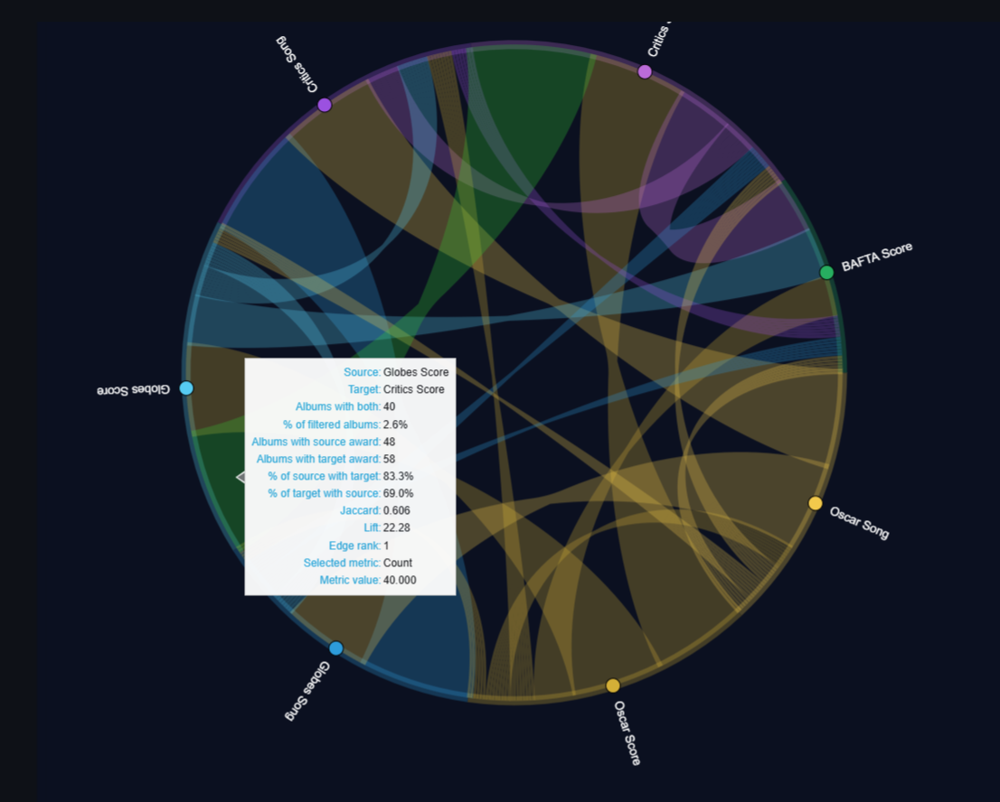
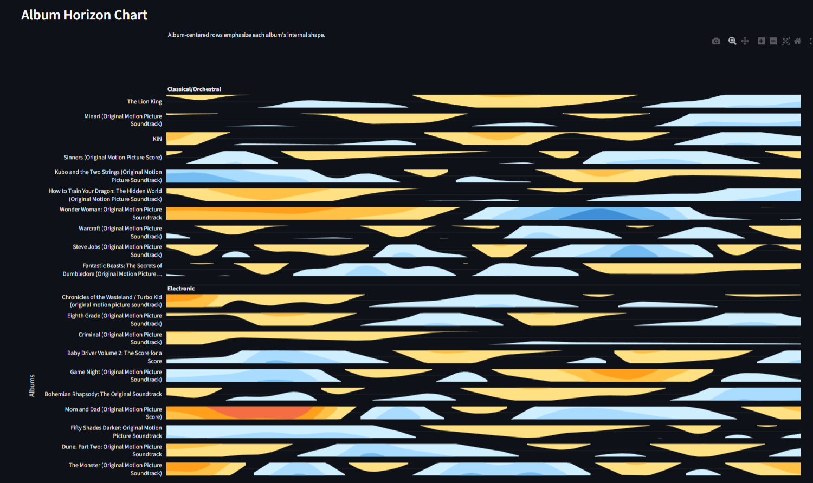

# 🎼 Soundtrack Popularity Analysis

An end-to-end data science project exploring what drives the success of film soundtracks — integrating multi-source data, feature engineering, exploratory analysis, and statistical modeling into an interactive Streamlit application.

🔗 **Live App**: https://soundtrack-popularity-explorer.streamlit.app/
📦 **Repo**: https://github.com/jesingson/soundtrack-popularity-analysis

---

## 🧭 Project Context

This project builds on a collaborative milestone:

👉 https://github.com/soundtrack-analytics-team/Drivers-of-Film-Soundtrack-Popularity

The milestone focused on:

* constructing a unified dataset across film, album, and track levels
* performing structured exploratory analysis
* developing initial statistical models

This repository extends that work into a **fully interactive analytical system**, with deeper feature engineering and multi-level modeling.

---

## 🚀 What This Project Adds

* Introduces **track-level and album-structure analysis**
* Builds **novel engineered features** (cohesion, track lift, structural metrics)
* Implements **filter-aware, interactive modeling workflows**
* Extends analysis from static notebooks → **production-style analytical app**

---

## 🧱 Data Sources

The dataset integrates multiple external sources:

* **TMDB** → film metadata (genres, budget, revenue, popularity)
* **Last.fm** → album and track listeners/playcounts
* **Spotify-style audio features (RapidAPI)** → energy, tempo, loudness, etc.
* **MusicBrainz** → album-track relationships
* **Custom scraping** → awards (Oscars, BAFTA, Critics)

---

## 🛠 Feature Engineering

Key transformations include:

* **log-transformed targets**

  * `log_lfm_album_listeners`
  * `log_lfm_track_playcount`

* **album cohesion metrics**

  * consistency/variance across track-level audio features

* **track-level structure**

  * relative track position
  * track lift vs album baseline

* **release timing**

  * film–album lag
  * time since release

* **genre normalization**

  * binary genre flags across film and album

---

## 🧪 Modeling Approach

Rather than relying on a single regression model, this project uses **comparative modeling** to understand system behavior:

### Album-level

* Full models (with exposure controls)
* Models without exposure variables
* Structure-only models (removing exposure + film genre)

### Track-level

* Track-only models (audio + structure)
* Track + context models (film + album controls)

This enables identification of:

* **confounding variables**
* **suppressed effects**
* **robust predictors across levels**

---

## 📊 Key Findings

### 1. Exposure dominates — but obscures underlying structure

Film-level exposure (e.g., vote count, popularity) explains a large share of soundtrack performance. When included, it suppresses the apparent impact of many other variables.

---

### 2. Many predictors are masked by exposure

When exposure variables are removed, several effects emerge:

* film rating (quality)
* film genres (e.g., animation, fantasy)
* release timing

This indicates that these variables are **confounded by exposure rather than irrelevant**.

---

### 3. Album cohesion is a robust, independent driver

Album cohesion remains strongly significant across all model specifications:

* full models with exposure controls
* models without exposure
* structure-only models

This suggests that **internal album design meaningfully contributes to success**, independent of visibility.

---

### 4. Structural and content effects persist without exposure

In models that exclude both exposure and film genre:

* **classical/orchestral soundtracks** show strong positive effects
* **film rating** becomes significant
* **release timing** remains important

These reflect **intrinsic content and structure**, not marketing scale.

---

### 5. Track performance depends heavily on context

Two track-level models were compared:

| Model           | R²    | Insight                               |
| --------------- | ----- | ------------------------------------- |
| Track-only      | ~0.03 | Audio and structure appear predictive |
| Track + context | ~0.32 | Film + album context dominates        |

When film and album controls are added:

* overall explanatory power increases dramatically
* many audio feature effects shrink or disappear
* **track position remains strongly significant**

👉 Track-level performance is largely driven by **context**, but structural effects persist.

---

### 6. Audio features are not primary drivers

Most audio features (tempo, mode, danceability) show weak or inconsistent effects once film and album context are introduced.

👉 This challenges common assumptions in music analytics.

---

### 7. Popularity operates in layered systems

Soundtrack success reflects two interacting mechanisms:

* **Top-down exposure effects**
  (film visibility, audience reach)

* **Bottom-up structural effects**
  (cohesion, genre, sequencing, timing)

---

### 8. Apparent insignificance can be misleading

Variables that appear unimportant in full models often become significant when dominant predictors are removed.

👉 Demonstrates the importance of testing for **confounding and suppression effects**

---

## 📈 Model Comparison Summary

| Model                  | R²    | Insight                               |
| ---------------------- | ----- | ------------------------------------- |
| Album (full)           | ~0.16 | Exposure dominates                    |
| Album (no exposure)    | ~0.13 | Hidden effects emerge                 |
| Album (structure-only) | ~0.10 | Cohesion + genre + quality persist    |
| Track (track-only)     | ~0.03 | Misleading standalone signals         |
| Track (with context)   | ~0.32 | Context dominates, structure persists |

---

## 🌟 Highlight Pages

### 🎼 Co-occurrence & Cross-Entity Explorer

* How do film genres, album genres, and awards interact?
* Features an interactive **Chord diagram** to visualize relationships across entities
* Reveals structural overlaps and unexpected genre pairings

---

### 🎵 Track Sequence Explorer

* How does listener engagement evolve across an album?
* Identifies **front-loading effects** and listener drop-off patterns

---

### 🎵 Track Cohesion Explorer

* Do more consistent albums perform better?
* Validates cohesion as a **robust structural predictor**

---

### 🎵 Track ↔ Album Relationship Explorer

* What defines a breakout track?
* Shows how a small number of tracks often drive album success

---

### 📊 Ridge (Distribution) Explorer

* How do feature distributions differ across performance levels?
* Uses **smoothed density (ridge) plots** to reveal structural differences

---

### 📊 Concentration Explorer

* Are outcomes driven by a few hits or broad engagement?
* Uses **Gini coefficients, top-N share, and Lorenz curves**

---

## 🏗 Architecture

* `data_processing.py` → dataset construction
* `analysis.py` → statistical utilities
* `ridge_analysis.py` → distribution modeling
* `regression_analysis.py` → OLS pipelines
* `track_regression_analysis.py` → track-level modeling
* `app_controls.py` → shared UI controls
* `pages/` → modular Streamlit explorers

---

## 💡 What This Project Demonstrates

* multi-source data integration
* advanced feature engineering
* modeling across multiple granularities
* understanding of confounding and causal structure
* building production-style analytical tools

---

## 🤝 Credits

Dataset and initial modeling:

👉 https://github.com/soundtrack-analytics-team/Drivers-of-Film-Soundtrack-Popularity

---

## 🔥 Executive Summary

> Once exposure is removed, soundtrack success is most strongly associated with album cohesion, orchestral composition, and film quality — while track-level performance is largely driven by context, with structural effects like sequencing remaining independently significant.
